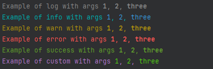

# @makerx/color-console

Wraps [chalk](https://github.com/chalk/chalk) and [console](https://developer.mozilla.org/en-US/docs/Web/API/console) to provide a console interface which automatically formats [tagged template literals](https://developer.mozilla.org/en-US/docs/Web/JavaScript/Reference/Template_literals#tagged_templates) with base text and interpolated arguments in different colours.

## Installation

```shell
npm i @makerx/color-console --save
```


## Example

```ts
import { colorConsole, createColorFormatter } from './index'
import chalk from 'chalk'

// Use the default colorConsole object
colorConsole.log`Example of log with args ${1}, ${2}, ${'three'}`
colorConsole.info`Example of info with args ${1}, ${2}, ${'three'}`
colorConsole.warn`Example of warn with args ${1}, ${2}, ${'three'}`
colorConsole.error`Example of error with args ${1}, ${2}, ${'three'}`
colorConsole.success`Example of success with args ${1}, ${2}, ${'three'}`

// Create your own custom formatter
const customLogger = createColorFormatter(chalk.magenta, chalk.greenBright, 'log', console)

customLogger`Example of custom with args ${1}, ${2}, ${'three'}`
```

will result in



